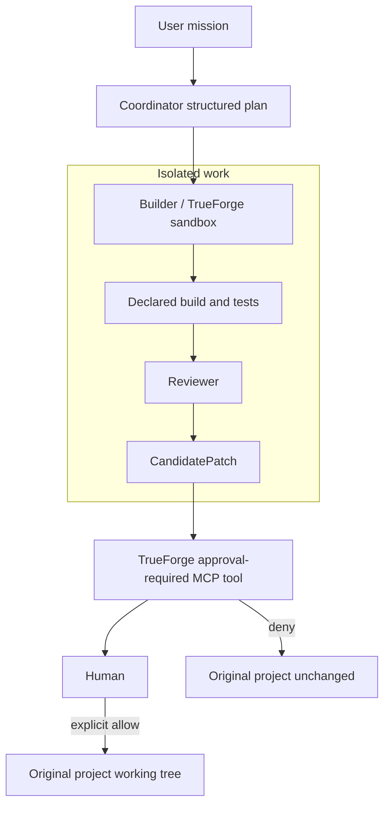

# ForgeOS Lite — TrueForge Edition

ForgeOS Lite is a local AI coding harness that coordinates planning, isolated execution, review, and human-controlled application for one Node.js Git project. It lets an AI Builder work usefully without silently granting it authority to mutate the user's real project.

> **Agents can propose. Humans authorize irreversible changes.**

TrueForge performs the real model-backed Builder work in an isolated sandbox, runs the declared validation commands, and supplies the real `tool.approval_required` event before the reviewed patch can reach the original project. ForgeOS Lite supplies the bounded contracts, Coordinator, Reviewer, candidate identity, and controlled application policy around that harness.

## Three-minute demo

Prerequisites are Node.js 22, Git, and an OpenAI API key stored as `OPENAI_API_KEY` in the ignored local `.env.local` file or the process environment. Never commit the key.

```sh
npm install
npm test
npm run demo:check
npm run demo
```

At the prompt, type `APPROVE` to send a real `user.tool_approval` allow response through TrueForge. The demo creates a fresh disposable Git fixture under `/tmp/forgeos-lite`, prepares and reviews a candidate in the TrueForge sandbox, proves the fixture remains unchanged, pauses at the real approval event, then applies exactly one reviewed source change. It creates no commit or push and cleans up its local services and temporary data.

Useful commands:

| Command | Purpose |
| --- | --- |
| `npm run demo` | Run the primary interactive allow demo |
| `npm run demo:deny` | Exercise the real denial path |
| `npm run demo:check` | Check prerequisites without exposing credentials |
| `npm run demo -- --keep-project` | Preserve the disposable target for inspection |
| `npm run verify` | Run tests, repository gates, the lightweight secret check, and npm audit |

## Safety story



The original project is read-only while the Coordinator, Builder, and Reviewer work. A content-addressed `CandidatePatch` is the only proposed output. The MCP application tool receives only a sealed context ID and cannot choose a target, submit patch content, or claim human identity. TrueForge pauses the destructive tool call, and the exact approval event is bound to one reviewed candidate before application.

## Authority boundaries

| Actor | Allowed | Never authorized |
| --- | --- | --- |
| Coordinator | Admit the project and create the bounded structured plan | Edit or apply |
| Builder | Work and validate only in the isolated TrueForge workspace | Approve or apply |
| Reviewer | Evaluate candidate identity, scope, and evidence | Edit or apply |
| Human | Authorize the exact irreversible application | Delegated to an agent |

Application revalidates the candidate, approval, Reviewer evidence, target root, clean Git state, exact base revision, safe paths, and expected file inventory. An approval is single-use. Successful application preserves Git `HEAD` and leaves an explicit uncommitted working-tree diff.

## TrueForge sponsor technology

TrueForge is operational, not decorative. ForgeOS Lite uses TrueForge 0.1.4 for:

- real local session execution;
- isolated sandbox work;
- model-backed Builder command execution with `gpt-5.4-mini`;
- declared build and test validation;
- the MCP `tool.approval_required` pause and `user.tool_approval` resume.

The CLI starts a disposable local TrueForge service and configures its temporary provider at runtime. The API key is passed only to that disposable service configuration, is never printed, and the temporary service data is removed at shutdown. The TrueForge installation and repository configuration are not modified.

TrueForge 0.1.4 supports remote Streamable HTTP MCP connectors rather than stdio connectors. The approval server therefore binds only to loopback and requires a random connector-only bearer token. HTTP command dispatch is model-mediated; ForgeOS Lite verifies the merged TrueForge tool event against the exact prevalidated command, working directory, and environment.

## Demo implementation

The terminal package is presentation and control-plane code only. It calls the existing Phase 1–4 public APIs and does not duplicate orchestration, review, candidate generation, application, or approval authority.

The fixture generator creates a tiny Git project from scratch for each run. Its declared build changes one greeting module, and its test accepts the baseline and expected demo sentence. The fixed Coordinator derives the public plan, the real TrueForge Builder runs the declared transformation and validation in a fresh clone, and the fixed Reviewer evaluates only structured evidence. The original is compared before approval and again after denial or application.

See [docs/DEMO-SCRIPT.md](docs/DEMO-SCRIPT.md) for the approximately three-minute narration, [docs/DEMO-EVIDENCE.md](docs/DEMO-EVIDENCE.md) for the exact live proof, and [docs/SUBMISSION-CHECKLIST.md](docs/SUBMISSION-CHECKLIST.md) for release readiness.

## Verification and credential safety

```sh
npm run verify
```

The official verification command runs formatting, unit and adversarial tests, the English-only gate, a lightweight obvious-secret check, and `npm audit --audit-level=low`. The secret check detects tracked `.env` files, OpenAI key assignments, private-key headers, and obvious secret-key prefixes. It is deliberately lightweight and is not a comprehensive credential scanner.

`.env.local` is ignored and must remain untracked. The preflight checks only whether `OPENAI_API_KEY` has a usable shape; it never displays the value. Real TrueForge execution is kept out of normal unit tests and remains an explicit demo integration command.

## Qodo Code Review Evidence

- [Phase 1 — mission contracts, state machine, and security boundaries](https://github.com/Eddienews/forgeos-lite-trueforge/pull/2): Qodo identified continuity gaps in project/base approval binding, cross-mission evidence, candidate identity, completion evidence, and canonical Reviewer-evidence hashing. The fixes added approval and evidence binding with regression coverage.
- [Phase 2 — TrueForge session adapter and isolated execution](https://github.com/Eddienews/forgeos-lite-trueforge/pull/3): Qodo reviewed the runtime boundary and its confinement, timeout/cancellation, command-substitution, and cleanup protections. The final reviewed head passed CI before human merge.
- [Phase 3 — candidate patch and approval-required MCP gate](https://github.com/Eddienews/forgeos-lite-trueforge/pull/4): Qodo findings drove stronger approval binding, workspace and target confinement, rollback safety, evidence binding, authority enforcement, and single-use behavior, each backed by regression tests.
- [Phase 4 — mission orchestration vertical slice](https://github.com/Eddienews/forgeos-lite-trueforge/pull/5): Qodo found validation-time mutation, evidence-workspace binding, Reviewer authority, transformation-proof, and traversal-bound issues. Corrections confine validation to the Builder workspace and bind exact evidence and scope to the reviewed candidate.
- [Phase 5 — demo workflow and submission readiness](https://github.com/Eddienews/forgeos-lite-trueforge/pull/6): the initial Qodo review found four valid security, correctness, and reliability issues. Follow-up work makes the shared temporary parent current-user-owned and private, accepts staged file deletions in the secret gate, verifies the completed TrueForge denial outcome, and attempts every cleanup step while preserving the primary error. Each correction has focused regression coverage; final-head follow-up review remains required before human merge.

Phase 0 governance is recorded separately in [PR #1](https://github.com/Eddienews/forgeos-lite-trueforge/pull/1). No substantive pull request is merged without CI, Qodo final-head review, resolved review threads, and explicit human approval.

## Scope and limitations

ForgeOS Lite currently supports one clean local Node.js Git repository and one fixed in-memory mission at a time. The demo intentionally uses a declared project build transformation rather than a general model-authored edit language. Mission journals and approval registries are in memory and are not restart-safe. Multi-file application uses complete preflight checks and best-effort rollback rather than a portable atomic filesystem transaction.

This phase does not add a web UI, backend, database, durable recovery, Python or static projects, general autonomous agents, multiple projects, teams, cloud execution, automatic commits, pushes, pull-request creation for target projects, deployment, billing, or marketplace features.

## Repository policy

All owned repository content must be exclusively in English, including code, identifiers, comments, interface text, logs, tests, fixtures, documentation, commit messages, branches, pull requests, Qodo responses, and demo materials. Generated dependencies and binary artifacts are excluded from the owned-text gate.

This public repository is a new hackathon implementation. It does not contain the separate proprietary ForgeOS product or its private implementation, skills, runtimes, governance, deployment, or enterprise features.

## License and marks

Source code is licensed under the [MIT License](LICENSE). See [TRADEMARKS.md](TRADEMARKS.md) for restrictions concerning the ForgeOS name and identity, and [NOTICE.md](NOTICE.md) for project provenance.
